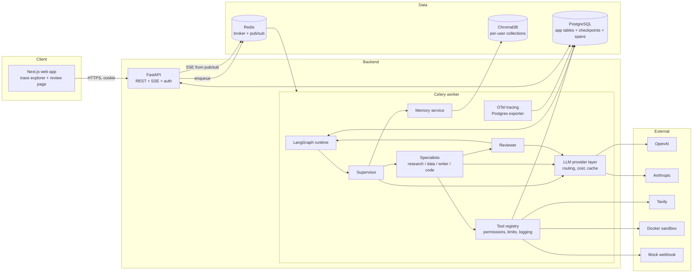
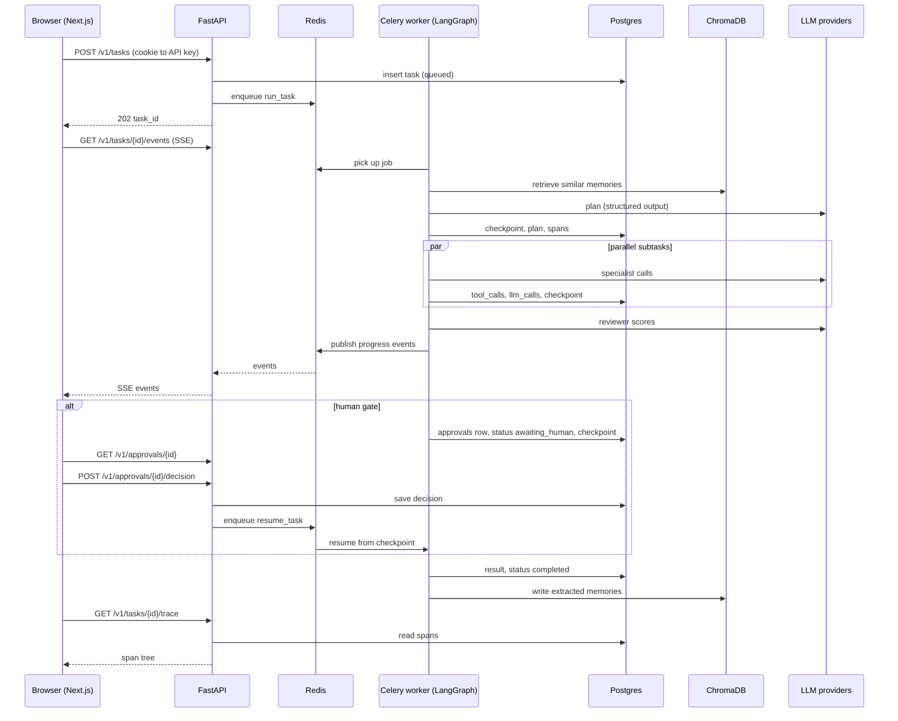

# architecture.md: Orchestra

## 1. App flow (user entry to core actions)

### A. Submit and run a task
1. The task submitter opens the web app, enters an API key, and types a request (for example "compare pgvector, ChromaDB and Qdrant for a 10M-document RAG workload and write a two-page recommendation").
2. `POST /v1/tasks` validates the request, inserts a `tasks` row with status `queued`, enqueues a Celery job, and returns `task_id` in under 200 ms.
3. The UI opens `GET /v1/tasks/{id}/events` (SSE) and shows live status.
4. A worker picks up the job and starts the LangGraph run with `thread_id = task_id`.
5. **Intake node:** loads the user, applies the per-task budget, creates the root trace span.
6. **Memory retrieval:** queries the user's Chroma collection for similar past tasks, approaches that worked or failed, and preferences. Retrieved memory ids are recorded on the span.
7. **Planning node:** the supervisor produces a structured `Plan` with dependency-ordered subtasks and a confidence score. The validator rejects cycles, unknown specialists, and missing formats. Invalid plans are regenerated up to 2 times.
8. **Escalation check on the plan:** if confidence is below the threshold, or the user asked for plan approval, the run pauses (see B).
9. **Execution:** subtasks with no unmet dependencies run in parallel through LangGraph `Send`. Each specialist calls tools through the registry. Every call is permission-checked, rate-limited, and logged.
10. **Review node:** the reviewer scores each output on correctness, completeness, format, and sources. Accept continues, reject returns to the specialist with feedback, and a second failure on the same subtask escalates.
11. **Synthesis node:** the supervisor combines accepted outputs into the deliverable.
12. **Final review and delivery:** the deliverable is stored in `tasks.result`, status becomes `completed`, and the SSE stream closes.
13. **Memory write:** an extraction step stores what was asked, what worked, tools used, facts found, and observed preferences.

### B. Human-in-the-loop pause
1. A trigger fires: low plan confidence, second failure on a subtask, a sensitive tool call, a low reviewer score, or an explicit user request.
2. `escalation.yaml` maps the trigger to a level: Notify, Approve action, Approve plan, or Take over.
3. For Approve action, Approve plan and Take over the node calls `interrupt()`. The checkpoint is saved in Postgres, the worker is released, and `tasks.status` becomes `awaiting_human`. Notify records the event and continues.
4. An `approvals` row is created with the packaged context: original task, plan, completed steps, the pending step, the proposed action, the agent's reasoning, and relevant memories.
5. The reviewer opens the review page, reads the context, optionally asks the agent a question through `/clarify`, and chooses approve, modify, reject, or take over.
6. `POST /v1/approvals/{id}/decision` records the decision and resumes the graph with the decision as the resume value. Modify replaces the proposed action, reject routes to a different approach or fails the subtask, take over stores the human's output and stands the agents down for that subtask.

### C. Crash recovery
1. A worker dies mid-run.
2. Celery re-delivers the job (late acknowledgement is enabled).
3. The graph resumes from the latest checkpoint for `thread_id`. Completed subtasks are not re-run because their results are in state, and tool calls carry an idempotency key.

### D. Debug a failed run
1. The agent developer opens the trace explorer for the task.
2. The tree shows supervisor, specialists, reviewer, tool calls, memory retrievals, and human events, colored by status.
3. Clicking a node shows the prompt, response, tokens, cost, and latency.
4. Replay loads a checkpoint, lets the developer edit an input, re-runs from that point, and compares the new trace with the original.

## 2. System architecture



### Explanation
- **API and worker are separate processes.** The API never runs an agent. It enqueues work and reads state, so it stays fast and a worker crash cannot take down the API.
- **LangGraph owns run state.** The Postgres checkpointer stores graph state at every step, which gives crash recovery and human pauses without a custom queue.
- **The tool registry is the only path to the outside world.** Specialists cannot call tools directly, so permissions, rate limits, logging, sandboxing, and approval gates live in one place.
- **The LLM provider layer is the only path to models.** It handles routing, retries, fallback, token and cost accounting, budget enforcement, and the dev cache. Tests swap in `FakeProvider` here.
- **Tracing is passive.** Spans wrap graph nodes, tool calls, LLM calls, and memory calls. The custom exporter writes them to Postgres, so the explorer needs no extra service.
- **Redis is not a source of truth.** It carries jobs and live events only. Losing it loses in-flight jobs, which Celery re-queues from Postgres task status on restart.
- **Memory is per user.** One Chroma collection per user, accessed only through the memory service.

## 3. Folder and file structure

```
orchestra/
├── api/
│   ├── main.py                 FastAPI app factory
│   ├── deps.py                 auth, role checks, db session
│   ├── routes/
│   │   ├── tasks.py            submit, status, SSE, cancel, trace, replay
│   │   ├── approvals.py        queue, decision, clarify
│   │   ├── memories.py         list, delete
│   │   ├── stats.py            cost and escalation aggregates
│   │   └── evals.py            start and read eval runs
│   └── schemas.py              request and response models
├── graph/
│   ├── state.py                Task, Subtask, Plan, GraphState
│   ├── build.py                graph wiring and conditional edges
│   ├── validate.py             plan validation (DAG, whitelist, limits)
│   ├── escalation.py           trigger to level mapping
│   └── nodes/
│       ├── intake.py
│       ├── retrieve_memory.py
│       ├── plan.py
│       ├── execute.py
│       ├── review.py
│       ├── synthesize.py
│       ├── human_gate.py       interrupt and resume logic
│       └── deliver.py
├── agents/
│   ├── supervisor.py           planning and synthesis prompts
│   ├── reviewer.py             rubric and scoring
│   └── specialists/
│       ├── research.py
│       ├── data_analysis.py
│       ├── writer.py
│       └── code_exec.py
├── tools/
│   ├── registry.py             registration, dispatch, logging
│   ├── permissions.py          specialist to tool map, sensitive flags
│   ├── limits.py               rate limiting
│   ├── builtin/                web_search, file_io, sandbox_exec, db_query, http_call
│   ├── sandbox/                Dockerfile and runner for code execution
│   └── mcp_server.py           exposes tools over MCP
├── llm/
│   ├── provider.py             interface, retries, fallback, budgets
│   ├── openai_client.py
│   ├── anthropic_client.py
│   ├── fake.py                 scripted provider for tests
│   ├── cache.py                dev cache keyed by request hash
│   └── routing.yaml            task role to model mapping
├── memory/
│   ├── store.py                Chroma and Postgres access
│   ├── extract.py              post-task extraction
│   ├── retrieve.py             planning-time retrieval
│   └── scoring.py              importance, access count, decay (stretch)
├── observability/
│   ├── tracing.py              span helpers and attributes
│   ├── exporter.py             Postgres span exporter
│   └── cost.py                 price table and rollups
├── worker/
│   ├── app.py                  Celery app, late ack, retry policy
│   └── tasks.py                run_task, resume_task
├── db/
│   ├── models.py               SQLAlchemy models
│   ├── repositories.py         user-scoped queries
│   └── migrations/             Alembic
├── evals/
│   ├── tasks/                  locked task set (YAML)
│   ├── graders/                deterministic checks and LLM judge
│   ├── baseline.py             single-agent baseline
│   ├── run.py                  run a configuration N times
│   └── report.py               generates the results table
├── security/
│   └── injection_suite/        attack cases and expected outcomes
├── web/                        Next.js app: trace explorer, review page, memory view
├── config/
│   ├── escalation.yaml         triggers, thresholds, level mapping
│   └── settings.py             environment-driven settings
├── tests/
│   ├── unit/
│   ├── integration/
│   └── e2e/
├── docs/
│   ├── decisions.md
│   └── images/                 architecture diagram exports
├── tasks/
│   ├── todo.md
│   └── lessons.md
├── scripts/
│   └── demo.py                 scripted showcase scenario
├── docker-compose.yml
├── pyproject.toml
├── .env.example
├── PRD.md  TRD.md  architecture.md  rules.md  phases.md  design.md
└── README.md
```

| Folder | Purpose |
|---|---|
| `api/` | HTTP surface only. No agent logic |
| `graph/` | State schemas, graph wiring, plan validation, escalation rules |
| `agents/` | Prompts and behavior of supervisor, reviewer, specialists |
| `tools/` | Registry, permissions, built-in tools, sandbox, MCP server |
| `llm/` | Everything that talks to a model provider |
| `memory/` | Long-term memory read, write, scoring |
| `observability/` | Tracing and cost accounting |
| `worker/` | Celery entry points |
| `db/` | Models, user-scoped repositories, migrations |
| `evals/` | Locked benchmark, baseline, graders, reports |
| `security/` | Attack suite |
| `web/` | Frontend |
| `config/` | YAML and settings |
| `tests/` | Unit, integration, e2e |
| `docs/`, `tasks/` | Decisions, plan, lessons |
| `scripts/` | Demo runner |

## 4. Tech stack summary
| Layer | Choice |
|---|---|
| Backend | Python 3.11, FastAPI |
| Agents | LangGraph with Postgres checkpointer |
| Queue | Celery, Redis |
| Data | PostgreSQL 16, ChromaDB |
| Models | OpenAI and Anthropic behind `llm/provider.py` |
| Tracing | OpenTelemetry with Postgres exporter |
| Frontend | Next.js, TypeScript |
| Sandbox | Docker |
| Ops | Docker Compose, GitHub Actions |

Full detail and version policy are in `TRD.md`.

## 5. Data flow between frontend, backend, and database



| Flow | Path | Notes |
|---|---|---|
| Command | Browser → API → Postgres → Redis → worker | API returns before any LLM call |
| Live progress | Worker → Redis pub/sub → API → SSE → browser | Loss of an event is recoverable by reading Postgres |
| State | Worker ↔ Postgres | Checkpoint after every node |
| Memory | Worker ↔ Chroma, metadata in Postgres | Only through the memory service |
| Tracing | Worker → span exporter → Postgres → API → explorer | No separate tracing backend |
| Human decision | Browser → API → Postgres → Redis → worker | Resume value comes from the stored decision, never from the browser directly |
